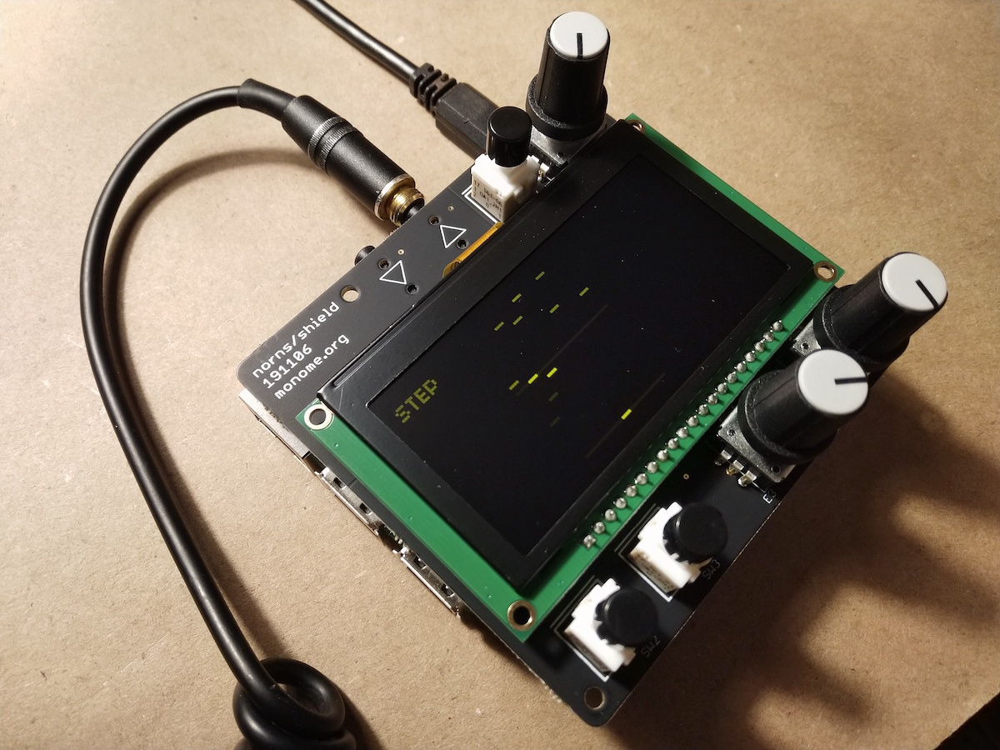
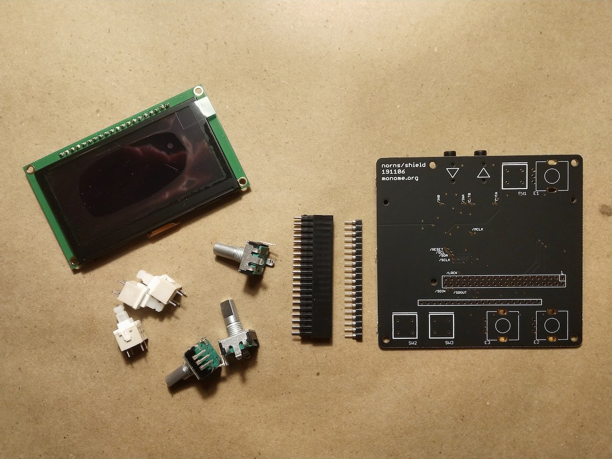
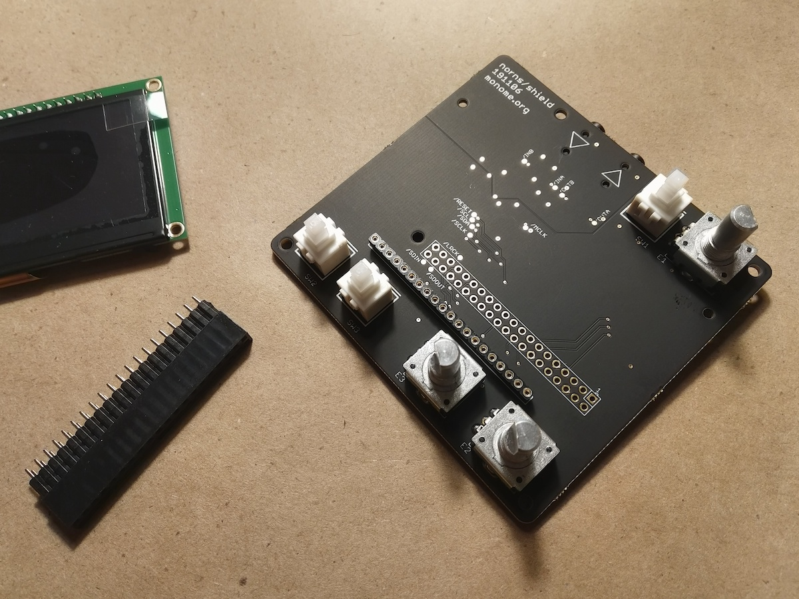
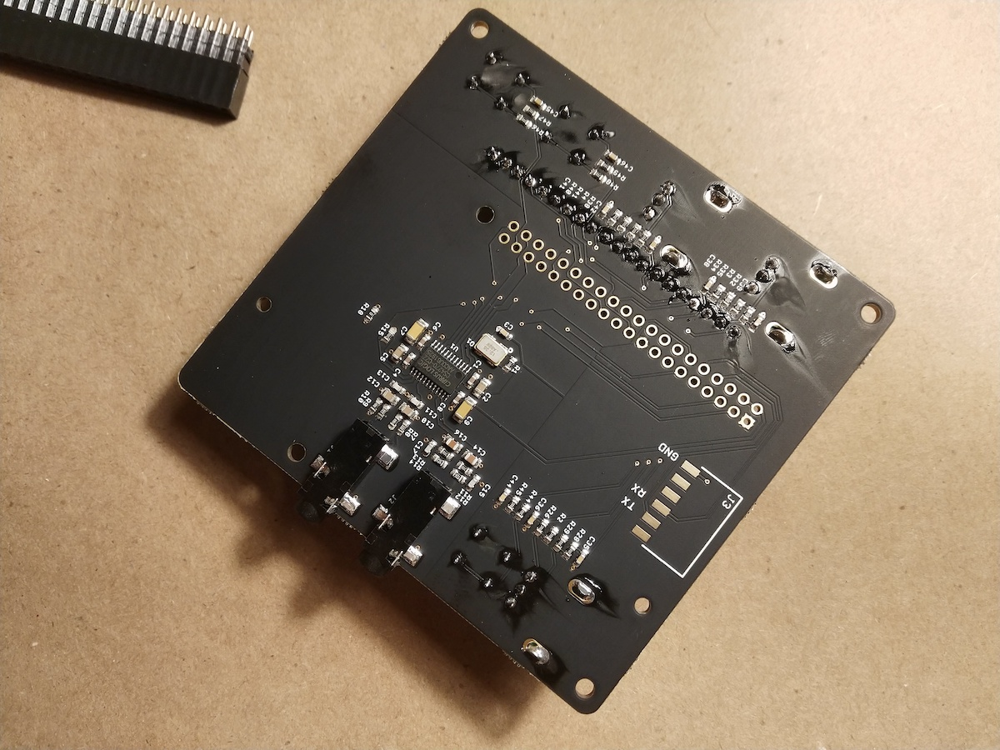

# norns-shield

minimal/tiny open-source/DIY shield for Raspberry Pi boards, providing hardware compatibility with the [norns](monome.org/norns) ecosystem.

- audio codec: CS4720
- audio jacks: 3.5mm stereo in/out, line level
- OLED: NHD-2.7-12864WDW3
- 3x pushbuttons, 3x rotary encoders

see the full [BOM on Octopart](https://octopart.com/bom-tool/Q3rQej3x)

see [https://llllllll.co/t/diy-norns-shield](https://llllllll.co/t/diy-norns-shield/27638) for discussion.

[monome.org](https://monome.org)

full kit and SMD-populated PCB available from [monome.org](https://market.monome.org)

## assembly

for SMD-populated circuit.

parts shown (header already soldered to OLED)

first solder the OLED header. then the encoders, and keys.

then attach the pi header to the other side and solder as shown.

attach the screen to the top. note that you may have to apply substantial pressure for it to connect: put something hard on top of the header while applying pressure so you don't wreck your thumbs.

likewise, attaching the keycaps requires substantial pressure. be sure they are aligned well then press hard.

the knobs should go on easily in comparison.

---

attach the shortest spacers with short screws, which props up the screen.

four spacers with the male thread insert from the top. for the bottom, the long remaining spacers go in front, shorter in back as shown.

align the plate and attach with short screws. don't tighten the screws until you've aligned the keys and knobs, as there's a little wiggle room for fine tuning.

attach the pi and add two plastic spacers, then balance the plate on top. the holes with spacers need the two long screws, the front use short screws.

## setting up

get the newest shield image from [https://github.com/monome/norns-image/releases](https://github.com/monome/norns-image/releases)

use [etcher](https://www.balena.io/etcher/) to make your SD card. it's by far the most reliable method.

## troubleshooting

- most soldering problems can be solved simply by reheating solder joints. bad solders can result in various problems: screen doesn't turn on, knobs/keys don't work.
- use a good SD card, not a cheap one. if you're having trouble, try using a different card.
- be sure to use the correct power supply. the pi will not power well from a laptop and you'll get confusing errors. get a dedicated 2A USB supply, or very high output USB battery.

## notes

- the shield does not have a headphone output, but headphones work fine on the main output. the headphone gain level within the norns menu does nothing in this case.
- the battery indication will not function, as there's no battery.

## mechanicals

- 2 Female Threaded Hex Standoff Aluminum, 3/16" Hex, 5/16" Long, 2-56 Thread 91780A104
- 2 Female Threaded Hex Standoff Aluminum, 3/16" Hex, 5/8" Long, 2-56 Thread 91780A111
- 2 Female Threaded Hex Standoff Aluminum, 3/16" Hex, 3/4" Long, 2-56 Thread 91780A113
- 4 Male-Female Threaded Hex Standoff Aluminum, 3/16" Hex Size, 1/2" Long, 2-56 Thread Size 93505A213
- 4 Off-White Nylon Unthreaded Spacer 1/4" OD, 3/32" Long, for Number 6 Screw Size 94639A247
- 8 Black-Oxide 18-8 Stainless Steel Pan Head Phillips Screws 2-56 Thread, 1/4" Long 91249A050
- 2 Black-Oxide 18-8 Stainless Steel Pan Head Phillips Screws 2-56 Thread, 3/8" Long 91249A054

